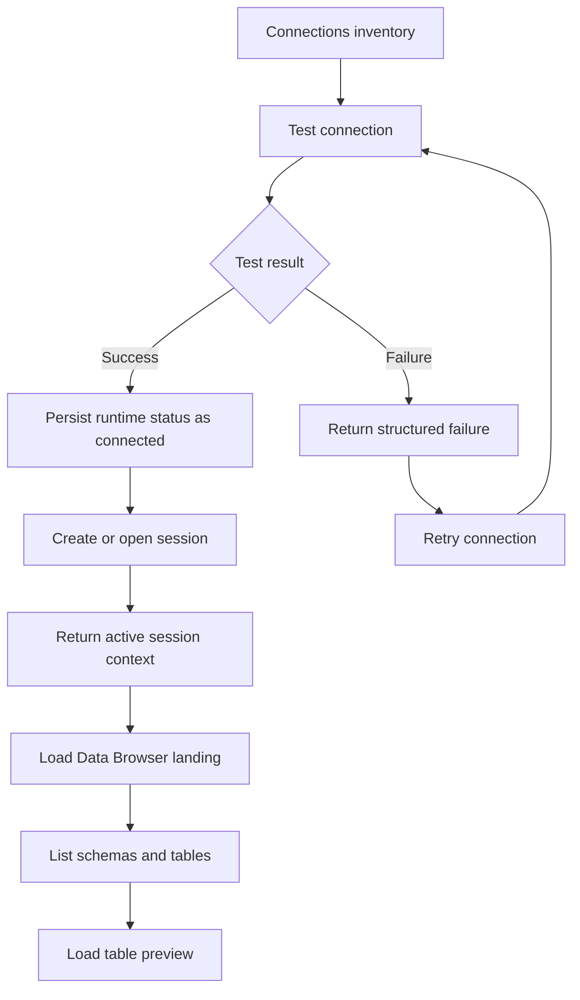

# FerrumDB V0.3 Backend Interface Requirements

## Problem Frame

FerrumDB 的前端已经从单纯的连接 CRUD 页，演进到一个可演示的 V0.3 原型：用户可以在连接卡片上看到连接状态，执行测试与重试，成功后进入工作区，并默认落到以结构浏览为核心的 Data Browser。当前这些能力仍由前端 mock 状态驱动，但如果后端接口不尽快把这些状态和数据面收敛成稳定契约，后续前后端联调时就会重新发明会话模型、错误语义和数据浏览入口。

这份文档的目标，是基于当前前端已实现行为，为 V0.3 后端接口定义一份清晰、最小但可信的需求文档。它不要求后端立刻实现所有高级能力，但要求接口语义足够稳定，让前端可以从 mock 平滑切换到真实数据源。

## Frontend Signals

当前前端已经明确依赖或隐含依赖以下行为：

- `src/contexts/ConnectionsContext.tsx` 已稳定使用 `list_connections`、`create_connection`、`update_connection`、`delete_connection` 四个连接管理接口。
- `src/contexts/WorkspaceContext.tsx` 已形成独立的运行时状态模型，区分 `idle`、`connected`、`failed`、`reconnecting` 四种连接状态。
- `src/App.tsx` 已把连接测试、失败重试、进入工作区、关闭会话、删除当前激活连接后的退场逻辑串成完整前端链路。
- `src/components/data-browser/DataBrowserPage.tsx` 已明确要求后端最终能提供 schema 列表、表元信息、列信息和样例数据预览。
- `src/types/workspace.ts` 已隐含出后端未来需要提供的最小会话上下文与数据浏览结构。

## User Flow

## Requirements

**Connection Inventory Compatibility**
- R1. 现有连接管理接口必须继续可用，且不因 V0.3 的会话能力引入破坏性返回结构变化。
- R2. `list_connections` 返回的连接列表必须继续满足前端 Connections 页的搜索、环境筛选和卡片展示需求。
- R3. 连接列表接口不得返回可被前端直接用于重建凭据的敏感字段明文。
- R4. 删除连接时，如果该连接存在活跃会话，后端必须返回一个可让前端明确结束该会话的结果语义，而不是让前端猜测。

**Connection Test and Session Lifecycle**
- R5. 后端必须提供一个“测试已保存连接”的接口，使前端可以从连接卡片直接发起连接测试，而不必重新提交整份连接表单。
- R6. 连接测试接口必须返回明确的成功或失败结果，并为失败场景提供结构化错误信息，而不是仅返回不可解析的字符串。
- R7. 连接测试成功后，后端必须支持创建或打开一个工作区会话，使前端可以从“已保存连接”进入“活跃工作区”。
- R8. 活跃会话接口必须返回前端工作区壳层所需的最小上下文，包括当前连接标识、连接名称、数据库类型、默认数据库、环境和只读/标准访问模式。
- R9. 后端必须支持关闭活跃会话，供前端显式退出当前工作区。
- R10. 后端必须允许前端在已有活跃会话的前提下切换模块，而不要求为每次切换重新建立数据库连接。
- R11. 如果连接在重试或后续访问中失效，后端返回的错误语义必须足以让前端回退到 Connections 视图并清理当前会话。

**Data Browser Landing**
- R12. 后端必须提供“按会话加载 Data Browser 初始数据”的接口，以支持连接成功后的默认落点是 Data Browser，而不是 SQL Editor。
- R13. Data Browser 初始数据必须优先服务结构浏览，至少包含 schema 列表、每个 schema 下的表列表，以及每张表的基本元信息。
- R14. 前端选择具体表时，后端必须支持按会话和表标识返回表摘要、列定义和样例数据预览。
- R15. 列定义返回中至少应包含列名、类型、是否可空、是否主键，以满足当前结构优先 UI。
- R16. 表预览接口必须能表达“表存在但当前无预览行”的状态，不能把空数据和接口失败混为一谈。
- R17. Data Browser 的接口设计必须允许后续扩展到分页、排序、筛选和更深的数据浏览，而不推翻 V0.3 的基础返回结构。
- R18. SQL Editor 在 V0.3 仍是次级入口，因此后端不需要在本阶段补齐高级查询能力，但活跃会话模型必须能被未来 SQL Editor 复用。

**Error Model and State Semantics**
- R19. 所有新接口都应返回前端可稳定映射的错误码或错误类型，至少能区分认证失败、网络不可达、TLS/证书问题、超时、连接不存在、会话失效和未知错误。
- R20. 连接测试失败和数据浏览失败必须是两个不同层级的错误语义，前者发生在进入工作区前，后者发生在已有会话内。
- R21. 会话失效错误必须让前端知道“当前会话不可继续使用”，而不是只给出一次普通请求失败。
- R22. 重试连接时，后端不要求主动推送 `reconnecting` 状态，但接口语义必须允许前端在请求期间稳定表现为 `reconnecting`，并在结果返回后收敛到成功或失败。
- R23. 后端返回的错误信息必须兼顾用户展示与调试定位，至少包含可展示摘要和可记录的细节字段两层语义。
- R24. 空列表、空 schema、空表预览、连接不存在和权限不足必须是彼此可区分的结果，不得统一折叠为泛化错误。

**Security and Environment Framing**
- R25. 后端必须把环境信息和只读/标准访问模式视为会话上下文的一部分，而不是仅仅附着在连接列表卡片上。
- R26. 对生产环境连接，后端应返回权威的只读/高风险标记，避免前端仅依赖环境名称字符串自行推断。
- R27. 后端不得在任何会话接口或 Data Browser 接口中回传敏感凭据、完整密码或可逆密钥材料。
- R28. 如果后端判断连接可建立但当前策略要求只读访问，必须显式返回该限制，让前端工作区壳层持续展示该安全语义。

## Recommended Interface Surface

以下接口名是基于当前前端实现推导出的推荐契约名称。传输层可以是 Tauri command、内部 IPC 或其他本地接口，但语义应保持一致。

| Interface | Purpose | Minimum Request | Minimum Response |
|-----------|---------|-----------------|------------------|
| `list_connections` | 加载连接列表 | 无 | `Connection[]`，保持与当前前端兼容 |
| `create_connection` | 创建连接配置 | `{ data }` | 创建后的 `Connection` |
| `update_connection` | 更新连接配置 | `{ id, data }` | 更新后的 `Connection` 或明确 not found |
| `delete_connection` | 删除连接配置 | `{ id }` | `{ deleted: true, invalidated_session_id?: string }` |
| `test_connection` | 测试已保存连接 | `{ connection_id }` | `{ ok, status, connection_id, error? }` |
| `open_connection_session` | 进入工作区 | `{ connection_id }` | `{ session }` |
| `close_connection_session` | 显式关闭会话 | `{ session_id }` | `{ closed: true }` |
| `get_session_overview` | 拉取当前会话上下文 | `{ session_id }` | `{ session }` |
| `list_session_schemas` | Data Browser 首屏结构数据 | `{ session_id }` | `{ database_label, schemas }` |
| `get_table_preview` | 表结构和样例数据预览 | `{ session_id, schema_name, table_name, limit? }` | `{ table, columns, preview_rows }` |

## Response Shape Guidance

**Connection test result**

- 成功时至少返回：
  - `ok: true`
  - `status: "connected"`
  - `connection_id`
  - 可选 `message`
- 失败时至少返回：
  - `ok: false`
  - `status: "failed"`
  - `error.code`
  - `error.message`
  - `error.retryable`

**Session payload**

- `session.id`
- `session.connection_id`
- `session.connection_name`
- `session.db_type`
- `session.database`
- `session.environment`
- `session.access_mode`，建议值至少包含 `standard` / `read_only`

**Schema listing payload**

- `database_label`
- `schemas[]`
- `schemas[].name`
- `schemas[].tables[]`
- `schemas[].tables[].name`
- `schemas[].tables[].description`
- `schemas[].tables[].row_count_label` 或等价元信息

**Table preview payload**

- `table.id`
- `table.name`
- `table.description`
- `table.columns[]`
- `table.columns[].name`
- `table.columns[].type`
- `table.columns[].nullable`
- `table.columns[].is_primary_key`
- `preview_rows[]`
- 明确区分 `preview_rows: []` 与接口失败

## Success Criteria

- 前端可以用真实后端替换当前 `WorkspaceContext` 里的 mock 逻辑，而不需要重写连接状态机。
- 前端可以从 Connections 卡片发起真实连接测试，并根据结构化结果稳定展示 `connected` / `failed` / `reconnecting`。
- 前端可以在连接成功后通过真实会话接口进入工作区，并在壳层持续展示当前连接、环境和只读状态。
- 前端可以通过真实 Data Browser 接口加载 schema 树、切换表并展示样例数据预览。
- 删除当前激活连接、关闭会话、会话失效和空表预览等边界情况，都有明确且可实现的后端语义。

## Scope Boundaries

- 本文档仅覆盖 V0.3 所需的后端接口契约，不要求实现 SQL 编辑器高级查询能力。
- 不要求在本阶段引入 SSH、跳板机、团队协作或插件接口。
- 不要求在本阶段实现 Data Browser 的完整分页、排序、筛选，只要求接口结构能兼容后续扩展。
- 不要求在本阶段定义 ER Diagram、History、Settings 等模块的数据接口。
- 不要求后端按本文档直接采用某种网络协议；本文档强调的是语义契约，不是传输实现细节。

## Key Decisions

- 连接测试和进入会话拆成两个语义动作：这样更符合当前前端“先 test、后 enter workspace”的用户链路。
- 会话是后端一等对象：Data Browser 和后续 SQL Editor 都应围绕同一个活跃会话工作，而不是每个模块各自重新建连。
- Data Browser 首屏以结构为先：接口优先提供 schema/tree/table metadata，再提供受控的样例数据预览。
- 错误必须结构化：V0.3 的用户感知很大程度来自失败态与重试态，因此错误不能只是一段不可解析的字符串。
- 安全语义以后端为准：生产环境只读与风险标记最终应来自后端权威判断，而不是仅由前端根据环境名称推断。

## Outstanding Questions

### Resolve Before Implementation

- 会话标识应采用进程内短生命周期 ID，还是可跨窗口/跨页面恢复的持久标识？这个选择会影响 `open_connection_session` 与 `get_session_overview` 的契约形态。
- `test_connection` 是否只接受 `connection_id`，还是也需要支持“未保存连接草稿测试”？如果后者要支持，应明确是否属于 V0.3 范围。

### Deferred to Later Planning

- `list_session_schemas` 与 `get_table_preview` 是否需要合并为一个首屏聚合接口，还是保持分离以降低首包体积。
- `row_count_label` 应由后端直接提供友好文案，还是提供原始计数/估算值让前端格式化。
- SQL Editor 在后续接入时，是复用同一个 `session_id` 直接执行查询，还是引入独立的 query execution contract。

## Sources & References

- Frontend origin: `docs/brainstorms/v0.3-frontend-prototype-requirements.md`
- Frontend integration point: `src/App.tsx`
- Existing connection API usage: `src/contexts/ConnectionsContext.tsx`
- Frontend runtime session model: `src/contexts/WorkspaceContext.tsx`
- Shared workspace types: `src/types/workspace.ts`
