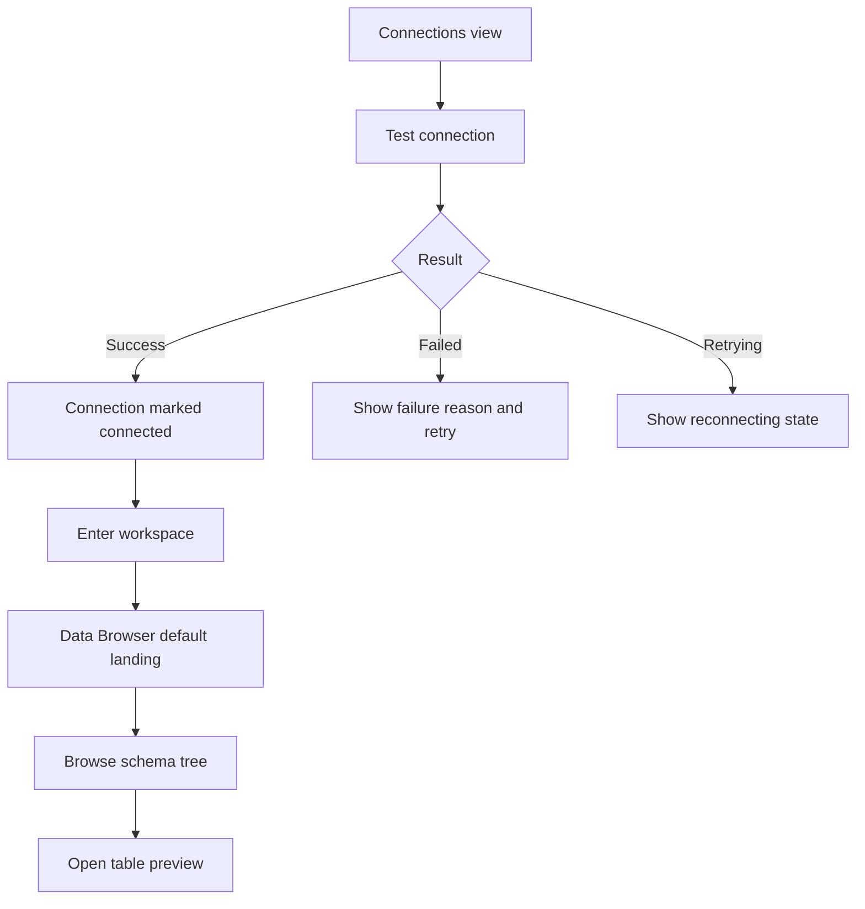

# FerrumDB V0.3 Frontend Prototype Requirements

## Problem Frame

FerrumDB's current frontend is still anchored around a single Connections page with placeholder navigation for downstream modules. That is enough for V0.2 framing, but it does not yet express the core V0.3 product promise: a user should be able to understand connection health, enter a real-looking workspace context, and start exploring database structure immediately after connecting.

For this frontend-first phase, the goal is not to ship real backend connectivity yet. The goal is to define and demonstrate the product behavior of V0.3 clearly enough that frontend development can proceed independently and later backend integration does not need to invent session states, entry flows, or workspace expectations.

## Requirements

**Connection State Framing**
- R1. The Connections screen must show a clear, user-facing connection lifecycle for each saved connection, including at minimum `connected`, `failed`, `reconnecting`, and an idle pre-connect state.
- R2. The connection lifecycle must be understandable from the card itself without requiring the user to open a detail modal first.
- R3. A failed or reconnecting state must preserve user confidence by pairing the state label with an obvious next action such as retrying the connection attempt.
- R4. Production-tagged connections must carry a stronger safety framing than non-production connections, including a visible read-only indicator once a session is entered.

**Session Entry and Workspace Context**
- R5. A successful connection flow must allow the user to enter a workspace context directly from the connection card or its immediate action area.
- R6. Once a session is active, the shell must show which connection is currently in use, its environment, and whether the session is read-only.
- R7. The active-session context must remain visible while moving between the workspace shell and the default landing view so the user does not lose orientation.
- R8. The product must treat session entry as a meaningful transition from "saved connection inventory" to "active workspace," rather than as a minor inline state change on the same screen.

**Data Browser Default Experience**
- R9. The default landing view after a successful connection must be Data Browser, not SQL Editor.
- R10. The first Data Browser view must prioritize structure browsing, with schema and table discovery taking precedence over a full data-grid-first presentation.
- R11. The initial Data Browser experience must let the user move from schema tree to table selection to a lightweight data preview without requiring any SQL authoring.
- R12. SQL Editor may appear as an available sibling destination in the shell, but it must not compete with Data Browser as the primary first-stop experience in this prototype.

**Demo Completeness and State Coverage**
- R13. The prototype must cover both the happy path and the key non-happy-path states that shape trust in V0.3, especially `failed`, `reconnecting`, retry behavior, and production read-only framing.
- R14. The frontend must be demoable without backend dependency by using mock data and deterministic state transitions that make each major status and screen reliably reproducible.
- R15. The prototype must feel like a credible separation-of-concerns milestone: frontend behavior, visual hierarchy, and interaction expectations should be stable enough for later backend/API work to implement against.

## Success Criteria

- A reviewer can start from the Connections view, trigger a successful connection, and land in a Data Browser experience that clearly feels like an active workspace rather than a future placeholder.
- A reviewer can also demonstrate failed, reconnecting, retry, and production read-only states without ambiguity about what the product is communicating.
- The active connection context remains legible after entering the workspace, so the user always knows which environment and safety mode they are operating in.
- The prototype makes Data Browser feel like the natural first destination after connecting, while keeping SQL Editor visibly secondary for this phase.
- Planning and backend integration can proceed without needing to redefine user-visible session states or the connection-to-workspace transition.

## Scope Boundaries

- No real database connectivity is required in this frontend-first phase.
- No backend code in `src-tauri` is part of the scope or source of truth for this requirements slice.
- No advanced SQL authoring behavior, query execution, or result-grid depth is required beyond what is needed to frame SQL Editor as a secondary destination.
- No multi-session management system is required beyond what is necessary to express one clear active-session context.
- No SSH, jump server, credential-policy expansion, or persistence of real session state is required in this phase.

## Key Decisions

- Data Browser first: the primary post-connect landing experience is Data Browser, not SQL Editor, because this phase should emphasize understanding database structure before editing or querying.
- Structure browsing over data-grid immediacy: the first impression should help users orient to schemas and tables quickly instead of dropping them into a dense grid too early.
- State completeness over happy-path-only polish: the prototype must demonstrate failure and safety framing as first-class product behavior, not as afterthoughts.
- Frontend-first separation: this document defines the user-visible behavior independently of backend implementation so frontend progress is not blocked by integration timing.

## Alternatives Considered

- SQL Editor as the default landing view: rejected because it makes the first V0.3 impression more query-centric than orientation-centric.
- Mixed overview dashboard as the first session screen: rejected because it would diffuse attention and weaken the structure-browsing story for the prototype.
- Happy-path-only prototype: rejected because it would underrepresent the trust and safety expectations that matter most once real connections are introduced.

## Dependencies / Assumptions

- The current frontend baseline is a Connections-first shell with placeholder downstream navigation, as reflected in `src/App.tsx`, `src/components/layout/Sidebar.tsx`, and `src/components/connections/ConnectionCard.tsx`.
- `version-plan.md` remains the roadmap-level source for overall release sequencing, while this document narrows V0.3 to the frontend-first prototype slice.
- Backend/API design for real connectivity will follow later and should conform to the user-facing states and transitions defined here unless planning deliberately revises them.

## Outstanding Questions

### Deferred to Planning
- [Affects R1-R4][Technical] What is the smallest deterministic frontend state model that can express idle, connected, failed, reconnecting, and retry transitions without creating throwaway complexity?
- [Affects R5-R8][Technical] What shell and routing structure best expresses the transition from connection inventory to active workspace while still keeping the prototype simple?
- [Affects R9-R12][Needs research] What is the minimum believable Data Browser content model for schemas, tables, and sample rows that feels realistic across both MySQL and PostgreSQL demos?
- [Affects R14][Technical] Which states need explicit demo controls or fixtures so reviewers can reliably trigger each scenario during validation?

## Next Steps

-> /ce:plan for structured implementation planning
