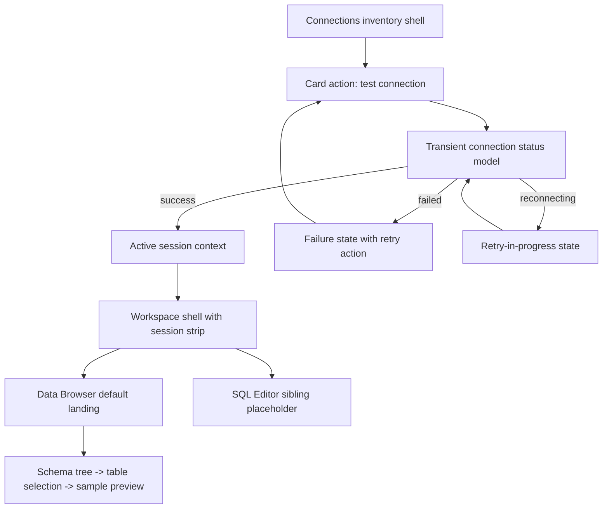

# V0.3 Frontend Session Entry Prototype

## Overview

This plan turns the current Connections-first frontend into a frontend-only V0.3 prototype that can express connection health, enter an active workspace, and land users in a structure-first Data Browser experience without depending on real backend connectivity. The goal is to preserve the existing V0.2 shell quality while making the connection-to-workspace transition believable, reproducible, and stable enough for later backend/API work to implement against.

## Problem Frame

The current frontend already demonstrates a polished Connections inventory, but it still behaves like a single-page CRUD surface with placeholder downstream navigation. The origin requirements define V0.3 as the point where users can understand connection state, enter a session context, and begin exploring database structure immediately after connecting (see origin: docs/brainstorms/v0.3-frontend-prototype-requirements.md). This plan focuses on the frontend-only slice of that outcome: no `src-tauri` changes, no real connectivity, and no invented backend contract beyond what the UI needs to model deterministic states and transitions.

## Requirements Trace

- R1-R4. Connection cards must communicate lifecycle state, retry affordances, and stronger production safety framing.
- R5-R8. A successful connection must transition into an active workspace with persistent session context in the shell.
- R9-R12. Data Browser must be the default landing surface and emphasize schema/table orientation over query-first behavior.
- R13-R15. The prototype must cover happy and non-happy paths, run without backend dependency, and create a credible handoff target for later integration.

## Scope Boundaries

- No real database connectivity, session persistence, or backend/API implementation.
- No reads from or changes to `src-tauri`.
- No advanced SQL execution behavior beyond a shell-level sibling destination for future SQL Editor work.
- No multi-session manager beyond one clear active session and the transitions needed to enter or leave it.
- No SSH, credential-policy expansion, or hidden debug-only flows that substitute for user-facing product behavior.

## Context & Research

### Relevant Code and Patterns

- `src/App.tsx` currently owns the entire user journey as a Connections-only page with local filter state, modal control, and CRUD actions. This is the main integration point for introducing workspace-mode switching without adding premature routing complexity.
- `src/contexts/ConnectionsContext.tsx` uses `createContext` + `useReducer` for list loading and CRUD mutations. That pattern is the closest existing fit for a UI-only workspace/session context.
- `src/components/layout/Layout.tsx`, `src/components/layout/Header.tsx`, and `src/components/layout/Sidebar.tsx` already define the shell contract for active navigation, header framing, and content region composition.
- `src/components/connections/ConnectionCard.tsx` is the current object-level affordance surface for each saved connection and should remain the place where lifecycle state and session entry actions become legible.
- `src/__tests__/App.connections-page.test.tsx`, `src/__tests__/App.connections-states.test.tsx`, and `src/components/connections/__tests__/ConnectionCard.test.tsx` show the existing Vitest + Testing Library style: full-component rendering, user-event flows, and state assertions through visible text rather than implementation details.
- `src/test/mocks/tauri.ts` already centralizes Tauri invoke mocking for tests. The prototype should extend this testability pattern instead of introducing an unrelated test harness.

### Institutional Learnings

- `docs/solutions/security-issues/connection-security-validation-fix-2026-04-08.md` reinforces two frontend-relevant constraints: credential fields should never become visible in read/list flows, and production-facing connection framing should err toward explicit safety signals. The prototype should therefore keep runtime session state separate from persisted connection credentials and avoid inventing any UI that implies plaintext secret visibility.
- `docs/solutions/patterns/critical-patterns.md` was not present during planning research, so no cross-cutting critical-patterns file could be incorporated.

### External References

- None. Local patterns are sufficient for this frontend-only planning slice, and the work does not depend on external APIs, framework migrations, or high-risk domain guidance.

## Key Technical Decisions

- Keep persisted connection data and transient runtime state separate. The existing `Connection` type should remain focused on saved configuration, while connection lifecycle status, retry progress, and active-session metadata live in frontend-only workspace/session types.
- Prefer a shell-mode transition over adding a routing dependency. The current app has no router and no multi-page contract yet, so this prototype should express inventory-to-workspace movement through explicit app state and shell composition rather than introducing route infrastructure only to simulate two screens.
- Use fixture-driven demo scenarios rather than a debug control panel. Reproducible states should come from seeded connection profiles and deterministic transitions that a reviewer can trigger through normal UI actions.
- Make Data Browser the first complete downstream surface and keep SQL Editor as a sibling placeholder. This preserves the product decision from the origin doc while avoiding premature parallel depth in multiple modules.
- Carry production safety into the active workspace shell. Read-only framing belongs in the active session context, not only on the connection card, so users keep seeing the environment risk signal after entering the workspace.

## Open Questions

### Resolved During Planning

- How should runtime connection state be modeled without touching persistence? A frontend-only session/workspace model should sit beside the existing connection inventory model so saved records stay clean and runtime state stays explicit.
- How should the app express the workspace transition without overbuilding navigation? Use an app-level shell mode that switches the main content from inventory to workspace while reusing the existing `Layout` contract.
- What is the minimum believable Data Browser payload for this prototype? Provide schema groups, table metadata, and sample rows for a selected table so users can browse structure first and preview data second.
- How should state coverage stay reproducible in demos? Seed fixtures with deterministic scenario outcomes and drive them through normal card actions such as test, retry, and enter workspace.
- What should happen if the currently active connection is deleted from inventory management? Clear the active session, return the user to Connections inventory, and show explicit feedback so the workspace never points at an orphaned record.

### Deferred to Implementation

- The exact copy, iconography, and animation treatment for status transitions can be finalized during implementation as long as the state meaning stays aligned with the origin requirements.
- The exact visual density of the table-preview pane can be refined during implementation once the structure-first layout is visible in the real shell.

## High-Level Technical Design

> *This illustrates the intended approach and is directional guidance for review, not implementation specification. The implementing agent should treat it as context, not code to reproduce.*

## Implementation Units

- [ ] **Unit 1: Establish prototype session domain and fixture-backed state**

**Goal:** Introduce explicit frontend-only types and state containers for connection lifecycle, active session context, and deterministic demo scenarios without mutating the persisted connection model.

**Requirements:** R1-R4, R6-R8, R14-R15

**Dependencies:** None

**Files:**
- Create: `src/types/workspace.ts`
- Create: `src/prototype/connection-scenarios.ts`
- Create: `src/prototype/data-browser-fixtures.ts`
- Create: `src/contexts/WorkspaceContext.tsx`
- Modify: `src/contexts/ConnectionsContext.tsx`
- Modify: `src/types/connection.ts`
- Test: `src/contexts/__tests__/WorkspaceContext.test.tsx`
- Test: `src/contexts/__tests__/ConnectionsContext.test.tsx`

**Approach:**
- Add explicit types for transient connection status, active workspace module, session safety framing, and structure-first browser content so the UI stops overloading `Connection` with runtime meaning.
- Keep the current connection inventory source intact where possible, but introduce a prototype-friendly adapter path that can seed deterministic scenario metadata alongside saved connections.
- Treat production read-only as derived session framing, not as a mutation of saved connection records.
- Keep any optional type changes to `src/types/connection.ts` limited to frontend-safe fields needed for inventory display; runtime-only session fields should live in the new workspace types.

**Patterns to follow:**
- `src/contexts/ConnectionsContext.tsx`
- `src/types/connection.ts`
- `src/test/fixtures/connections.ts`

**Test scenarios:**
- Happy path: initializing the workspace context with seeded scenarios exposes idle inventory records and no active session.
- Happy path: promoting a successful scenario creates an active session object that includes connection identity, environment, and read-only framing.
- Edge case: production connections derive read-only session framing even when the saved connection record itself does not carry runtime status.
- Error path: requesting a retry transition from a failed scenario returns the expected reconnecting state before resolving to its seeded outcome.
- Integration: connection inventory state and workspace session state stay independent so CRUD list refreshes do not erase or corrupt transient session metadata unexpectedly.

**Verification:**
- The frontend has a single source of truth for runtime session state that can be exercised in tests without mocking backend connectivity.

- [ ] **Unit 2: Upgrade connection cards into lifecycle and entry surfaces**

**Goal:** Make the Connections view itself legible as a V0.3 stateful launch surface by exposing status, test/retry actions, and enter-workspace affordances directly on each card.

**Requirements:** R1-R5, R13-R14

**Dependencies:** Unit 1

**Files:**
- Create: `src/components/connections/ConnectionStatusBadge.tsx`
- Create: `src/components/connections/ConnectionCardActions.tsx`
- Modify: `src/components/connections/ConnectionCard.tsx`
- Modify: `src/components/connections/ConnectionGrid.tsx`
- Modify: `src/components/connections/index.ts`
- Modify: `src/App.tsx`
- Test: `src/components/connections/__tests__/ConnectionCard.session-actions.test.tsx`
- Test: `src/__tests__/App.connection-session-entry.test.tsx`

**Approach:**
- Extend each card to show its current lifecycle state in-place, with action copy that changes between idle, failed, reconnecting, and connected scenarios.
- Keep edit and delete affordances available, but demote them behind the new session-launching actions so V0.3 reads as a workspace-entry surface rather than a CRUD management screen.
- Surface failure reasons and retry calls-to-action near the state indicator instead of burying them in global toasts alone.
- Only expose "Enter workspace" after a successful scenario, keeping the launch action explicit rather than auto-redirecting users after every successful test.

**Patterns to follow:**
- `src/components/connections/ConnectionCard.tsx`
- `src/components/connections/EnvironmentBadge.tsx`
- `src/components/ui/Toast.tsx`
- `src/__tests__/App.connections-states.test.tsx`

**Test scenarios:**
- Happy path: clicking a test action on a seeded-success connection updates the card to connected and reveals an enter-workspace action.
- Happy path: clicking enter workspace from a connected card transitions the app into the active workspace shell for that connection.
- Edge case: production connections show a stronger status treatment than development/staging connections while still preserving the same launch path.
- Error path: clicking a test action on a seeded-failure connection reveals a failed state with retry affordance and failure copy on the card.
- Error path: triggering retry from a failed state shows reconnecting feedback before settling into the seeded next outcome.
- Integration: card-level status changes do not break existing edit/delete actions or inventory filtering behavior.

**Verification:**
- A reviewer can understand and trigger the full v0.3 lifecycle directly from connection cards without relying on hidden controls or backend responses.

- [ ] **Unit 3: Introduce workspace shell mode and persistent session framing**

**Goal:** Turn the app shell into a two-mode experience that can move between inventory and active workspace while preserving orientation and safety context.

**Requirements:** R5-R8, R12-R13, R15

**Dependencies:** Unit 1, Unit 2

**Files:**
- Create: `src/components/workspace/SessionStrip.tsx`
- Create: `src/components/workspace/WorkspacePlaceholder.tsx`
- Modify: `src/App.tsx`
- Modify: `src/components/layout/Layout.tsx`
- Modify: `src/components/layout/Header.tsx`
- Modify: `src/components/layout/Sidebar.tsx`
- Modify: `src/components/layout/__tests__/Header.test.tsx`
- Modify: `src/components/layout/__tests__/Sidebar.test.tsx`
- Test: `src/__tests__/App.workspace-shell.test.tsx`

**Approach:**
- Add a top-level shell mode switch between inventory and active workspace, keeping `Layout` as the shared frame so the product still feels like one desktop application.
- Promote `Data Browser` and `SQL Editor` to meaningful workspace destinations when a session exists, while leaving unrelated modules inactive.
- Add a persistent session strip or equivalent shell-level framing that shows connection name, environment, database type, and read-only state after entry.
- Provide a clear way back to the Connections inventory without collapsing the meaning of an active session into the same visual layer as saved inventory management.

**Patterns to follow:**
- `src/components/layout/Layout.tsx`
- `src/components/layout/Header.tsx`
- `src/components/layout/Sidebar.tsx`
- `src/App.tsx`

**Test scenarios:**
- Happy path: entering a workspace updates sidebar active state to Data Browser and shows session framing in the shell header area.
- Happy path: returning to Connections from the workspace restores the inventory view without losing the saved connection list.
- Edge case: environment-less connections still show clear shell context when active, falling back gracefully without blank safety framing.
- Error path: deleting the currently active connection clears the session, returns the shell to inventory mode, and shows controlled user feedback instead of leaving stale workspace state behind.
- Error path: if a session is cleared after a failed reconnect, the shell returns to inventory mode instead of leaving the user in a broken workspace state.
- Integration: sidebar availability changes are driven by active-session context and do not make SQL Editor appear primary before a session exists.

**Verification:**
- The app reads as a coherent workspace with a real session boundary, not as a single page with extra conditional panels.

- [ ] **Unit 4: Build the structure-first Data Browser prototype**

**Goal:** Deliver the first credible post-connect workspace surface by letting users browse schemas, select tables, and preview representative rows without writing SQL.

**Requirements:** R9-R12, R14-R15

**Dependencies:** Unit 1, Unit 3

**Files:**
- Create: `src/components/data-browser/DataBrowserPage.tsx`
- Create: `src/components/data-browser/SchemaTree.tsx`
- Create: `src/components/data-browser/TableSummaryPanel.tsx`
- Create: `src/components/data-browser/TablePreviewGrid.tsx`
- Create: `src/components/data-browser/index.ts`
- Modify: `src/App.tsx`
- Modify: `src/components/layout/MainContent.tsx`
- Test: `src/components/data-browser/__tests__/DataBrowserPage.test.tsx`
- Test: `src/__tests__/App.data-browser-flow.test.tsx`

**Approach:**
- Use seeded workspace fixtures to populate a left-hand schema tree and a right-hand detail region that combines table summary and sample-row preview.
- Make the first selected state orientation-first: users should understand where they are in the database structure before they are asked to inspect dense tabular data.
- Keep SQL Editor visible as a sibling navigation destination, but render it as a lightweight placeholder surface until future work gives it real depth.
- Avoid overbuilding table tooling; sorting, filtering, and schema mutation are out of scope unless they are strictly needed to preserve prototype readability.

**Patterns to follow:**
- `src/components/layout/MainContent.tsx`
- `stitch/data_browser_editor/code.html`
- `stitch/connections_dashboard/code.html`

**Test scenarios:**
- Happy path: entering the workspace opens Data Browser by default with the expected schema tree and initial table context.
- Happy path: selecting a different table updates the summary panel and sample preview while preserving session framing.
- Edge case: a schema with one table or an empty sample-row set still renders an intelligible detail state rather than a broken grid.
- Error path: selecting a table whose fixture intentionally lacks preview rows shows a controlled empty preview state rather than crashing the page.
- Integration: switching from Data Browser to SQL Editor placeholder and back preserves the active session and selected connection context.

**Verification:**
- The first post-connect experience feels like browsing a real database structure, with Data Browser clearly acting as the primary landing module.

- [ ] **Unit 5: Consolidate demo scenarios and regression coverage**

**Goal:** Make the prototype safe to evolve by encoding the key demo flows and trust states into app-level tests and reusable fixtures.

**Requirements:** R1-R15

**Dependencies:** Unit 1, Unit 2, Unit 3, Unit 4

**Files:**
- Modify: `src/test/fixtures/connections.ts`
- Modify: `src/test/mocks/tauri.ts`
- Modify: `src/__tests__/App.connections-page.test.tsx`
- Modify: `src/__tests__/App.connections-states.test.tsx`
- Create: `src/__tests__/App.prototype-scenarios.test.tsx`
- Create: `src/test/fixtures/workspace.ts`
- Test: `src/__tests__/App.prototype-scenarios.test.tsx`

**Approach:**
- Promote the current fixture set from basic inventory samples into a deliberate scenario matrix that covers success, failure, reconnecting, and production read-only cases.
- Keep tests focused on user-visible text, navigation, and state transitions so they remain stable as layout details evolve.
- Preserve existing coverage for empty, loading, filtering, and bootstrap error states while layering new workspace flows on top.
- Treat the scenario matrix as the contract for future backend integration: later API work should be able to satisfy the same visible outcomes.

**Patterns to follow:**
- `src/__tests__/App.connections-page.test.tsx`
- `src/__tests__/App.connections-states.test.tsx`
- `src/test/mocks/tauri.ts`

**Test scenarios:**
- Happy path: a seeded-success connection can move from inventory to connected status to Data Browser landing without breaking existing inventory behaviors.
- Happy path: a production connection enters the workspace with visible read-only framing and retains that framing while navigating between modules.
- Edge case: clearing filters, editing a connection, or reopening inventory after a workspace session does not drop the fixture-driven status contract unexpectedly.
- Error path: seeded-failure and reconnecting scenarios render stable UI feedback and can be retried without uncaught promise errors.
- Integration: the full prototype scenario matrix remains deterministic under test with no dependency on live Tauri connectivity.

**Verification:**
- The prototype's defining states are protected by regression coverage and can be demonstrated consistently in local development and CI.

## System-Wide Impact

- **Interaction graph:** `src/App.tsx` becomes the composition point for inventory mode, workspace mode, and active module selection; `src/contexts/ConnectionsContext.tsx` remains responsible for saved inventory data; `src/contexts/WorkspaceContext.tsx` becomes the owner of runtime status and active session; layout and connection components consume both contexts to present state.
- **Error propagation:** connection test failures and reconnecting flows should remain local to card/session UI, with toast support for reinforcement rather than as the only error channel.
- **State lifecycle risks:** runtime status can drift from saved connection data if both are merged carelessly; deleting an active connection should clear the session and return to inventory so the workspace never retains an orphaned record.
- **API surface parity:** existing saved-connection CRUD types should stay stable; transient status and active session metadata must not leak into the persisted connection contract as though they were already backend fields.
- **Integration coverage:** app-level tests need to prove inventory -> connected -> workspace transitions, failed -> retry -> reconnecting flows, and production read-only continuity across shell navigation.
- **Unchanged invariants:** existing inventory filtering, empty/loading/error states, modal CRUD flows, and Tauri-invoke test patterns should continue to work after the workspace prototype lands.

## Risks & Dependencies

| Risk | Mitigation |
|------|------------|
| Runtime session metadata gets mixed into persisted connection records and becomes hard to replace with real backend data later | Keep transient session types separate from `Connection` and treat any display-only status as derived frontend state |
| `src/App.tsx` becomes an oversized coordination layer during the transition | Extract new workspace and data-browser components early, and move runtime state ownership into a dedicated `WorkspaceContext` |
| The demo fixture set drifts from future backend/API expectations | Encode scenario outcomes in app-level tests and keep fixture semantics aligned with the origin requirements rather than with ad hoc UI states |
| Production safety framing becomes purely cosmetic and inconsistent between inventory and workspace views | Carry the same environment/read-only signals through both card-level and shell-level presentation |
| Existing CRUD/filter regression coverage gets broken while introducing workspace behavior | Expand current App-level tests instead of replacing them, preserving load, empty, error, and filter assertions alongside new session flows |

## Documentation / Operational Notes

- No rollout or backend migration steps are required for this prototype-only slice.
- After implementation, the next planning artifact should define how real backend connectivity maps onto the frontend session model introduced here, rather than redefining the user-visible states from scratch.
- If the implementation adds new fixture modules or prototype-only folders, follow up by documenting their purpose so later backend integration can retire or replace them cleanly.

## Sources & References

- Origin document: `docs/brainstorms/v0.3-frontend-prototype-requirements.md`
- Version roadmap: `version-plan.md`
- Related code: `src/App.tsx`
- Related code: `src/contexts/ConnectionsContext.tsx`
- Related code: `src/components/connections/ConnectionCard.tsx`
- Related code: `src/components/layout/Layout.tsx`
- Related tests: `src/__tests__/App.connections-states.test.tsx`
- Related tests: `src/__tests__/App.connections-page.test.tsx`
- Design references: `stitch/connections_dashboard/code.html`
- Design references: `stitch/data_browser_editor/code.html`
- Institutional learning: `docs/solutions/security-issues/connection-security-validation-fix-2026-04-08.md`
