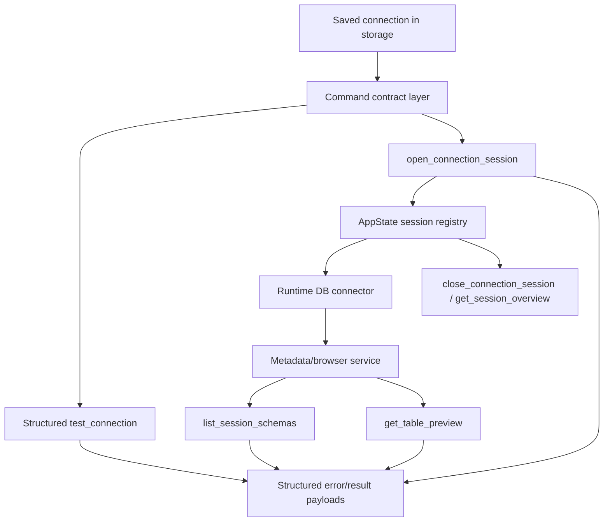
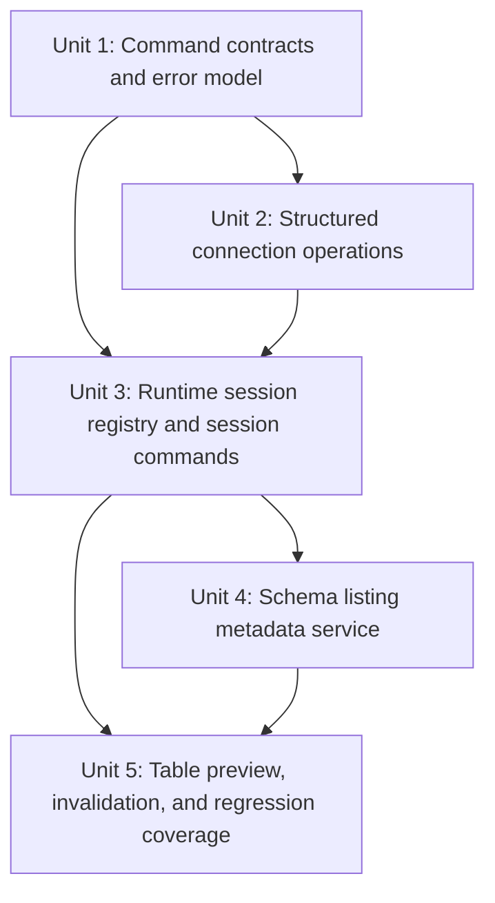
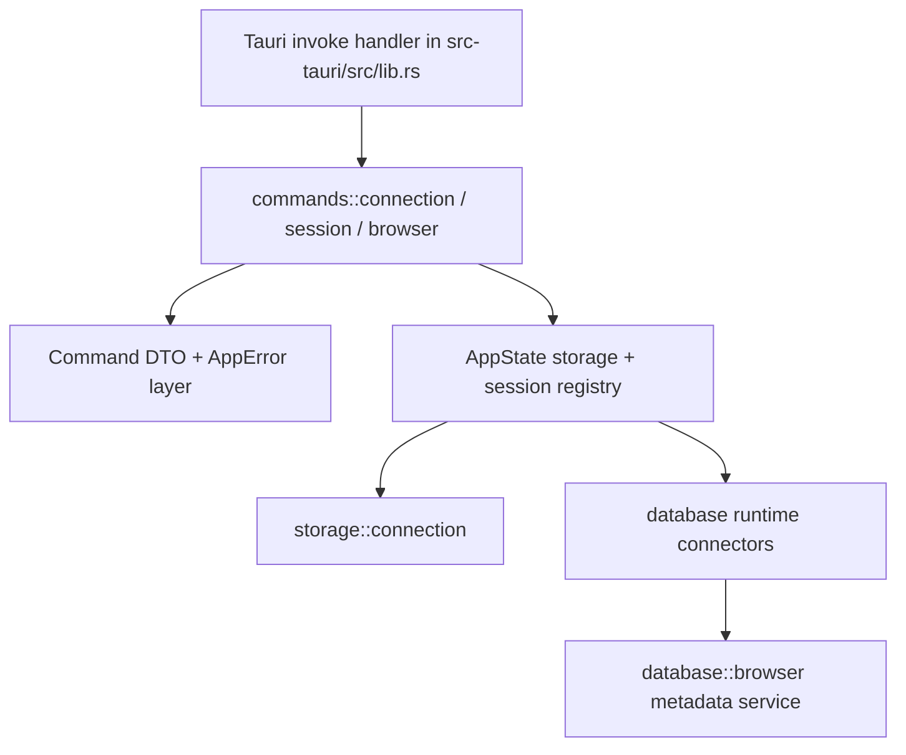

# V0.3 Backend Interface

## Overview

This plan turns the current `src-tauri` backend from a connection-CRUD + boolean test surface into the contract described by the V0.3 backend requirements: structured connection testing, backend-owned workspace sessions, and a structure-first Data Browser API. The work stays strictly inside `src-tauri`, preserves the meaning of the origin document's interfaces, and reuses the existing storage, crypto, and database connector modules instead of replacing them.

## Problem Frame

The origin requirements define V0.3 as the point where the frontend can stop relying on mock workspace behavior and instead call a real backend contract for connection testing, session entry, and Data Browser loading (see origin: `docs/brainstorms/v0.3-backend-interface-requirements.md`). The current backend already persists connection records, encrypts credentials, and can test a saved connection, but it still lacks three things the origin document assumes are real: structured errors, a first-class session lifecycle, and metadata/preview APIs for schema browsing. This plan closes that gap without changing the user-visible meaning of the documented interfaces.

## Requirements Trace

- R1-R4. Existing connection-management behavior must stay compatible while `delete_connection` grows explicit invalidation semantics.
- R5-R11. Connection testing must become structured, open a backend-owned workspace session, and let callers recover cleanly from connection or session failure.
- R12-R18. Data Browser must load from real session-scoped schema/table metadata and preview data, while keeping SQL Editor out of scope.
- R19-R24. New commands must normalize backend errors into stable contract-level codes and keep empty states distinct from failure states.
- R25-R28. Session payloads must carry environment and access-mode framing without exposing credentials or pushing policy inference back to the frontend.

## Scope Boundaries

- No reads from or changes to `src/` frontend code.
- No changes to the product meaning of the origin interfaces in `docs/brainstorms/v0.3-backend-interface-requirements.md`.
- No draft/unsaved connection testing in V0.3; testing remains scoped to saved connections.
- No SQL Editor execution contract, query history, ER diagram, or settings-module backend work.
- No cross-restart session persistence, multi-window session recovery, SSH tunneling, or plugin infrastructure.
- No requirement to make row counts exact when a cheap, consistent metadata label satisfies the documented payload semantics.

## Context & Research

### Relevant Code and Patterns

- `src-tauri/src/lib.rs` is the current integration point for Tauri command registration and app-managed state.
- `src-tauri/src/commands/connection.rs` already contains the command-layer patterns for Tauri IPC, storage access, and async connection testing, but currently serializes errors as raw strings and exposes only CRUD + boolean testing.
- `src-tauri/src/storage/connection.rs` already owns persisted connection records, credential masking for read/list flows, and password lookup for runtime use. It is the right persisted source of truth for saved connections.
- `src-tauri/src/database/traits.rs`, `src-tauri/src/database/mysql.rs`, and `src-tauri/src/database/postgres.rs` already define the runtime database connector layer. That layer is the right base for session-backed metadata browsing, but it should remain separate from command DTOs and error serialization.
- `src-tauri/src/database/errors.rs` already provides a small backend error taxonomy that can be expanded or mapped into a broader command-facing error model.
- `docs/brainstorms/v0.3-backend-interface-backend-feedback.md` captures the current backend feasibility constraints and is a useful implementation companion, but not a replacement for the origin requirements.

### Institutional Learnings

- `docs/solutions/security-issues/connection-security-validation-fix-2026-04-08.md` reinforces three constraints that matter directly to this plan: never leak stored passwords in read/list APIs, never silently swallow security-sensitive failures, and treat connection metadata validation as a backend responsibility rather than a UI convenience.

### External References

- None. Local patterns are sufficient for planning this backend slice, and the plan intentionally avoids over-specifying per-database introspection SQL before implementation.

## Key Technical Decisions

| Decision | Rationale |
|---|---|
| Keep the origin interface names and meanings intact, even when backend internals need refactoring | The frontend requirements doc is the source of truth for V0.3 contract semantics |
| Add a command-contract layer separate from storage/database models | `src-tauri` currently reuses storage structs directly; V0.3 needs stable IPC DTOs without leaking persistence concerns |
| Use process-local, short-lived session IDs stored in `AppState` | This satisfies the session requirement with the least carrying cost and best matches the current Tauri state model |
| Keep `test_connection` and `open_connection_session` as separate commands | The origin document explicitly treats test and workspace entry as two user-visible actions |
| Put schema browsing in a dedicated metadata/browser layer, not in storage and not as extra CRUD logic | Session lifecycle and metadata introspection are separate responsibilities and will evolve differently |
| Make backend policy own `access_mode` derivation in V0.3 | This preserves the requirement that the frontend receive backend-owned safety framing without requiring immediate database privilege introspection |

## Open Questions

### Resolved During Planning

- What session identifier scope should V0.3 use? Use process-local, short-lived UUIDs stored in an in-memory session registry attached to `AppState`.
- Should V0.3 support testing unsaved draft connections? No. Keep testing scoped to saved connections so the plan stays aligned with R5 and avoids creating a second credential-handling path.
- Should schema listing and table preview be merged into one command? No. Keep `list_session_schemas` and `get_table_preview` separate so the landing payload stays lightweight and table loading stays explicit.
- How should `access_mode` be produced before full privilege introspection exists? Treat it as backend-owned policy evaluation for V0.3, using stored environment and backend rules so the frontend never has to infer it itself.

### Deferred to Implementation

- The exact per-database introspection SQL for table descriptions, primary keys, and row-count labels should be finalized against real connector behavior during implementation.
- The exact normalization rules for driver-specific timeout/TLS/authentication failures should be refined when real errors are observed in tests.
- The precise serialization strategy for preview-row scalar values can be finalized once the first MySQL and PostgreSQL preview paths are visible in code.

## High-Level Technical Design

> *This illustrates the intended approach and is directional guidance for review, not implementation specification. The implementing agent should treat it as context, not code to reproduce.*

## Implementation Units

- [x] **Unit 1: Establish command contracts and structured error serialization**

**Goal:** Introduce explicit command-facing DTOs and a unified backend error model so V0.3 commands can satisfy the documented interface shapes without leaking storage structs or raw driver strings.

**Requirements:** R1-R3, R6, R8, R19-R24, R27

**Dependencies:** None

**Files:**
- Create: `src-tauri/src/commands/contracts.rs`
- Create: `src-tauri/src/commands/errors.rs`
- Modify: `src-tauri/src/commands/mod.rs`
- Modify: `src-tauri/src/commands/connection.rs`
- Test: `src-tauri/tests/command_contracts.rs`

**Approach:**
- Define command DTOs for saved-connection responses, structured test results, delete results, session overviews, schema listings, and table previews.
- Add a backend error type that can map storage, crypto, and database-layer failures into stable V0.3 error codes while preserving a user-facing summary and loggable detail.
- Keep storage models internal to the storage layer, and map them into command DTOs at the command boundary.
- Preserve the existing CRUD command names so the IPC surface grows by contract, not by replacement.

**Execution note:** Start with failing command-contract tests for serialized success and error payload shapes before wiring new runtime behavior.

**Patterns to follow:**
- `src-tauri/src/commands/connection.rs`
- `src-tauri/src/database/errors.rs`
- `src-tauri/src/storage/connection.rs`

**Test scenarios:**
- Happy path: serializing a saved connection response omits credential material while preserving id, environment, tags, and timestamps.
- Happy path: serializing a successful structured test result returns `ok`, `status`, and `connection_id` in the documented shape.
- Edge case: serializing a not-found delete/test/session error yields the stable contract error code rather than a raw Rust error string.
- Error path: storage, crypto, and driver-layer failures each map into a contract error object with `code`, `message`, and debug detail fields.
- Integration: command DTOs remain decoupled from storage structs so later session/browser commands can reuse the same contract layer without exposing persistence-only fields.

**Verification:**
- Every V0.3 command can return a stable, documented payload shape without reusing storage structs or raw driver error strings.

- [x] **Unit 2: Upgrade existing connection commands to V0.3 semantics**

**Goal:** Rework `list_connections`, `create_connection`, `update_connection`, `delete_connection`, and `test_connection` so the existing connection surface remains compatible while satisfying the richer V0.3 contract.

**Requirements:** R1-R6, R19-R24, R27

**Dependencies:** Unit 1

**Files:**
- Modify: `src-tauri/src/commands/connection.rs`
- Modify: `src-tauri/src/storage/connection.rs`
- Modify: `src-tauri/src/lib.rs`
- Test: `src-tauri/tests/connection_commands.rs`

**Approach:**
- Keep saved-connection CRUD behavior anchored to `storage::connection`, but update command return shapes to the V0.3 DTOs from Unit 1.
- Make `delete_connection` return explicit deletion semantics and surface whether an active session was invalidated, instead of collapsing every successful call to `()`.
- Rework `test_connection` to return structured outcomes with stable error codes and retryability semantics, while preserving the saved-connection-only boundary.
- Fail closed on credential-decryption failure so runtime connection paths stop falling back to ambiguous credential material.

**Execution note:** Implement the contract upgrade test-first around `delete_connection` and `test_connection`, since these are the highest-risk compatibility surfaces.

**Patterns to follow:**
- `src-tauri/src/storage/connection.rs`
- `docs/solutions/security-issues/connection-security-validation-fix-2026-04-08.md`

**Test scenarios:**
- Happy path: listing, creating, and updating saved connections still preserve current inventory fields while returning V0.3-safe DTOs.
- Happy path: `delete_connection` on an existing inactive connection returns `{ deleted: true }` with no invalidated session id.
- Edge case: `delete_connection` on a missing connection returns an explicit not-found result/error instead of a silent success.
- Error path: `test_connection` on a missing saved connection returns `connection_not_found`.
- Error path: `test_connection` on a record whose password cannot be decrypted returns a structured credential error instead of trying to connect anyway.
- Error path: unsupported database types and failed driver handshakes are surfaced as structured, contract-level failures.
- Integration: connection CRUD responses remain frontend-safe and do not grow runtime session state fields.

**Verification:**
- The existing connection command surface still represents persisted connections, but now produces the V0.3 result semantics the origin document expects.

- [x] **Unit 3: Introduce runtime session registry and session lifecycle commands**

**Goal:** Add backend-owned workspace sessions that callers can open, inspect, and close without reusing saved connection records as runtime state.

**Requirements:** R7-R11, R18, R21, R25-R28

**Dependencies:** Unit 1, Unit 2

**Files:**
- Create: `src-tauri/src/commands/session.rs`
- Create: `src-tauri/src/database/runtime.rs`
- Modify: `src-tauri/src/commands/mod.rs`
- Modify: `src-tauri/src/commands/connection.rs`
- Modify: `src-tauri/src/lib.rs`
- Test: `src-tauri/tests/session_lifecycle.rs`

**Approach:**
- Extend `AppState` with an in-memory session registry keyed by short-lived UUIDs and storing connection metadata, backend-owned access-mode framing, and a live database runtime handle.
- Add `open_connection_session`, `close_connection_session`, and `get_session_overview` commands that operate strictly on saved connections and runtime sessions.
- Keep session opening separate from `test_connection`, but share lower-level connection bootstrapping so both paths use the same credential handling and database selection logic.
- Ensure session invalidation is explicit: closed, missing, and no-longer-usable sessions must each route through stable error semantics instead of generic query failures.

**Execution note:** Start with session-lifecycle contract tests that prove open -> overview -> close -> invalidated behavior before attaching metadata browsing.

**Patterns to follow:**
- `src-tauri/src/lib.rs`
- `src-tauri/src/database/traits.rs`
- `src-tauri/src/database/mysql.rs`
- `src-tauri/src/database/postgres.rs`

**Test scenarios:**
- Happy path: opening a session from a valid saved connection returns the documented session overview fields, including environment and `access_mode`.
- Happy path: closing an active session makes subsequent overview calls return a session-invalid or not-found contract error.
- Edge case: opening a second session for a different saved connection does not overwrite the first session's metadata unexpectedly.
- Error path: opening a session for a missing saved connection fails with a connection-not-found contract error.
- Error path: opening a session after a failed runtime connection produces a structured session-opening failure instead of a raw driver string.
- Integration: a session's runtime metadata stays separate from persisted saved-connection records and can be invalidated independently.

**Verification:**
- The backend has a first-class workspace session lifecycle that callers can use without mutating saved connection state.

- [x] **Unit 4: Implement session-scoped schema listing through a metadata service**

**Goal:** Provide the structure-first Data Browser landing payload required by V0.3 while keeping metadata introspection separate from CRUD and session orchestration.

**Requirements:** R12-R13, R17-R18, R24

**Dependencies:** Unit 3

**Files:**
- Create: `src-tauri/src/commands/browser.rs`
- Create: `src-tauri/src/database/browser.rs`
- Modify: `src-tauri/src/database/mod.rs`
- Modify: `src-tauri/src/database/mysql.rs`
- Modify: `src-tauri/src/database/postgres.rs`
- Modify: `src-tauri/src/commands/mod.rs`
- Modify: `src-tauri/src/lib.rs`
- Test: `src-tauri/tests/schema_listing.rs`

**Approach:**
- Add a metadata/browser service that accepts a live session handle and dispatches database-specific introspection logic without turning the command layer into SQL glue code.
- Implement `list_session_schemas` as a session-scoped call that returns database label, schema names, table names, and light table metadata consistent with the origin payload guidance.
- Keep `row_count_label` best-effort and inexpensive so the landing response remains fast and the interface remains extensible without forcing exact counts in V0.3.
- Distinguish clearly between an empty schema listing, a missing session, and a permission/driver failure.

**Patterns to follow:**
- `src-tauri/src/database/mysql.rs`
- `src-tauri/src/database/postgres.rs`
- `src-tauri/src/commands/connection.rs`

**Test scenarios:**
- Happy path: `list_session_schemas` for a valid session returns database label, schemas, and per-table summary entries in the documented structure.
- Edge case: a valid session connected to an empty or low-privilege database returns an empty schema/table payload rather than a generic failure.
- Edge case: row-count label generation does not block or fail the entire response when only coarse metadata is available.
- Error path: calling `list_session_schemas` with a closed or missing session returns an explicit session error.
- Error path: metadata introspection failures caused by permissions or driver query errors are surfaced as structured Data Browser failures, distinct from connection-test failures.
- Integration: schema listing uses the same live session/runtime handle created by `open_connection_session` instead of opening a new connection per request.

**Verification:**
- A caller can land on a real, session-backed Data Browser tree without inventing schema metadata client-side.

- [x] **Unit 5: Implement table preview, deletion invalidation, and regression coverage**

**Goal:** Complete the V0.3 backend browsing contract by serving table details/preview rows and proving that deletion, session invalidation, and empty-preview states remain distinguishable.

**Requirements:** R4, R14-R18, R20-R24

**Dependencies:** Unit 3, Unit 4

**Files:**
- Modify: `src-tauri/src/commands/browser.rs`
- Modify: `src-tauri/src/commands/connection.rs`
- Modify: `src-tauri/src/database/browser.rs`
- Test: `src-tauri/tests/table_preview.rs`
- Test: `src-tauri/tests/session_invalidation.rs`

**Approach:**
- Implement `get_table_preview` on top of the metadata/browser service so table summary, column definitions, and preview rows come from the same session-backed runtime layer as schema listing.
- Normalize preview responses so empty preview rows remain a valid success state distinct from permission errors, missing tables, and invalid sessions.
- Finish the `delete_connection` <-> session invalidation handshake so deleting the active saved connection can return `invalidated_session_id` when required by the origin contract.
- Add regression coverage around the contract boundaries most likely to drift: empty table previews, missing sessions, invalidated sessions, and deletion after session creation.

**Patterns to follow:**
- `src-tauri/src/database/browser.rs`
- `src-tauri/src/commands/session.rs`
- `src-tauri/src/commands/connection.rs`

**Test scenarios:**
- Happy path: `get_table_preview` for a valid session/table returns table summary, column metadata, and preview rows in the documented shape.
- Happy path: deleting a saved connection that owns an active session returns the deleted result plus the invalidated session id, and the session becomes unusable afterward.
- Edge case: a table that exists but currently has no preview rows returns an empty preview success payload rather than an error.
- Edge case: nullable columns, primary-key flags, and database-native types are preserved in column metadata without requiring frontend inference.
- Error path: missing table, permission-denied introspection, and invalid session each produce distinct error outcomes instead of collapsing into one generic preview failure.
- Integration: opening a session, listing schemas, previewing a table, deleting the owning connection, and retrying preview produces the expected invalidation flow end-to-end.

**Verification:**
- The V0.3 backend can back the Data Browser's table-detail flow and the contract's most important failure/invalidation paths are protected by tests.

## System-Wide Impact

- **Interaction graph:** `src-tauri/src/lib.rs` remains the entry point for IPC registration; `commands` grows from one file into contract-aware submodules; `AppState` becomes the owner of both persisted storage and runtime sessions; the database layer gains a metadata/browser surface on top of existing connectors.
- **Error propagation:** storage, crypto, and driver failures should map into one command error pipeline so `test_connection`, session commands, and Data Browser commands all serialize failures consistently.
- **State lifecycle risks:** runtime sessions can leak or drift if they are not explicitly invalidated on close/delete/failure; deleting a saved connection must not leave a dangling usable session.
- **API surface parity:** saved-connection CRUD must remain frontend-safe and must not start carrying runtime-only session state; session/browser commands must reuse the same stable error and DTO conventions.
- **Integration coverage:** feature tests need to prove the end-to-end flow from saved connection -> structured test -> open session -> schema listing -> table preview -> delete/invalidate.
- **Unchanged invariants:** persisted connection storage stays in SQLite, credentials remain masked in read/list flows, testing remains scoped to saved connections, and no backend work is performed in `src/`.

## Risks & Dependencies

| Risk | Mitigation |
|------|------------|
| Session registry design grows into ad hoc global state | Keep all runtime-session ownership inside `AppState` with explicit create/lookup/close/invalidate helpers |
| Driver-level errors vary too widely across MySQL and PostgreSQL to map cleanly on the first pass | Centralize normalization in the command error layer and start with the documented minimum error taxonomy |
| Metadata introspection queries drift between databases and create inconsistent payloads | Put per-database SQL behind one browser service contract and keep the V0.3 payload intentionally minimal |
| `delete_connection` invalidation semantics diverge from current callers' assumptions | Treat the origin requirements doc as the contract source of truth and encode the new response shape in command-contract tests early |
| Best-effort row-count labels become slow or flaky | Keep labels inexpensive and non-authoritative so failure to compute them never breaks schema listing |

## Documentation / Operational Notes

- Keep `docs/brainstorms/v0.3-backend-interface-backend-feedback.md` aligned with any implementation-time findings that materially affect future frontend alignment, but do not treat it as the user-facing contract.
- If implementation reveals that one of the origin document's response fields needs clarification rather than a code-only fix, record that in a follow-up brainstorm/feedback doc instead of silently changing the contract in code.
- No rollout or migration procedure is required beyond shipping the new Tauri command surface, since session state remains in-memory.

## Sources & References

- Origin document: `docs/brainstorms/v0.3-backend-interface-requirements.md`
- Backend feasibility notes: `docs/brainstorms/v0.3-backend-interface-backend-feedback.md`
- Related code: `src-tauri/src/lib.rs`
- Related code: `src-tauri/src/commands/connection.rs`
- Related code: `src-tauri/src/storage/connection.rs`
- Related code: `src-tauri/src/database/traits.rs`
- Related code: `src-tauri/src/database/mysql.rs`
- Related code: `src-tauri/src/database/postgres.rs`
- Institutional learning: `docs/solutions/security-issues/connection-security-validation-fix-2026-04-08.md`
